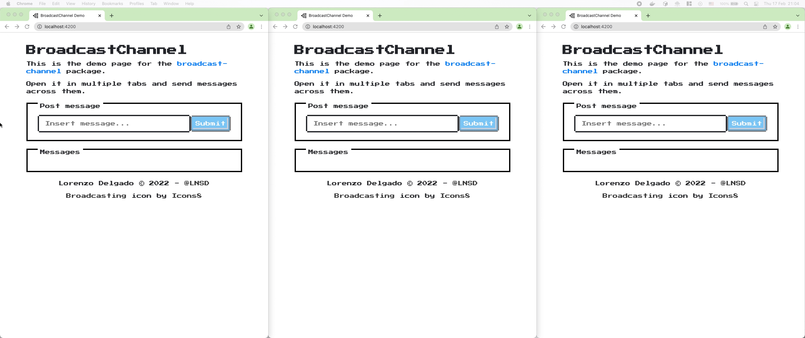

<h1 align="center">BroadcastChannel</h1>
<p align="center">
  <strong>A <a href="https://developer.mozilla.org/en-US/docs/Web/API/BroadcastChannel">BroadcastChannel</a> that works in old browsers, new browsers and web workers</strong>
  <br/>
</p>




---

## Getting started

```sh
npm install --save @lnsd/broadcast-channel
# or
yarn add @lnsd/broadcast-channel
# or
pnpm add @lnsd/broadcast-channel
```

## Usage

Create a channel instance:

```ts
import BroadcastChannel from '@lnsd/broadcast-channel';

type Message = { foo: string };

const channel = new BroadcastChannel<Message>('example');
```

Post a message to the channel:

```ts
channel.postMessage({ foo: 'Hello world!' });
```

Listen to channel messages:

```ts
channel.onmessage = function(message: MessageEvent<Message>) {
  console.log(message.data.foo);
};
// Hello world!
```

Close a channel if it is no longer needed:

```ts
channel.close();
```
